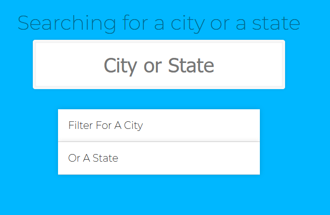
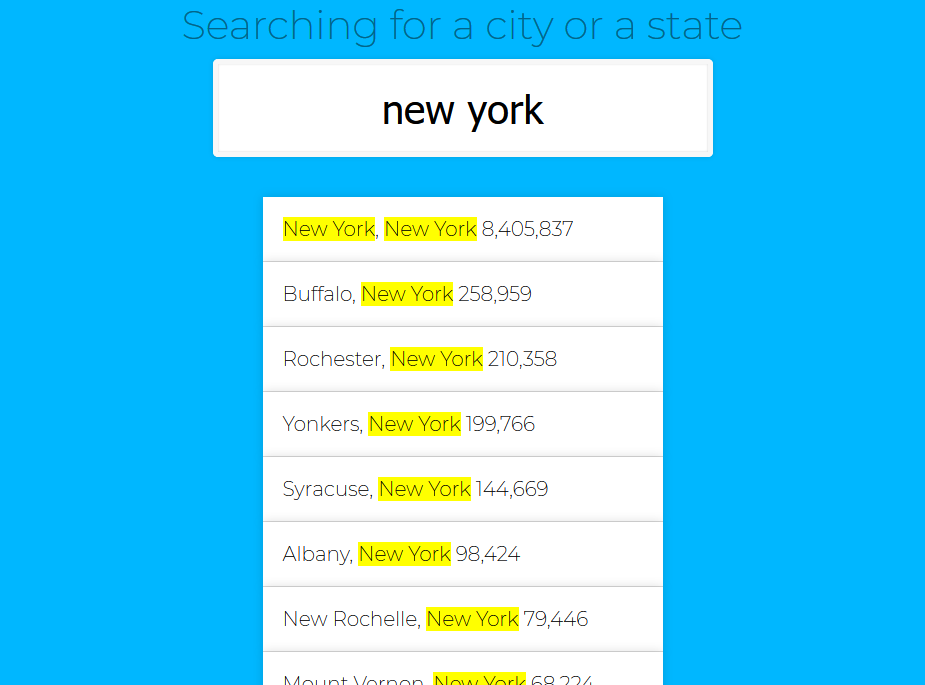
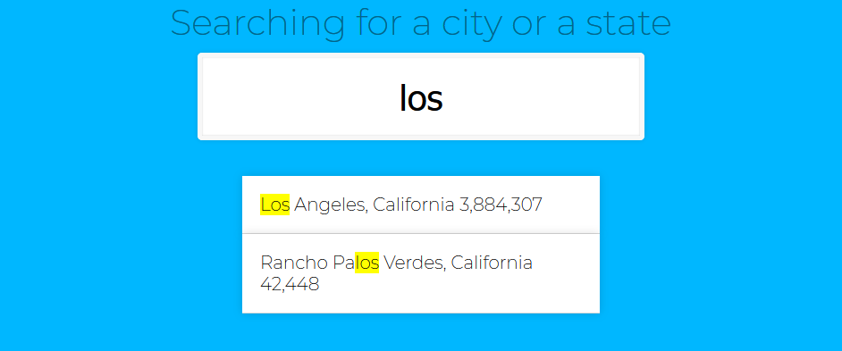

# Webpack & javascript exercise



## Setup

Install all packages:

```
npm install
```

## Directory structure

- src/
  - images/ (just ignore it)
  - js/
    - data.js (contain an array of objects, each object holds information about cities in US)
    - main.js (in this file comes your code)
  - scss/
    - main.scss (style using scss)
  - index.html (don't change this file)
- package.json
- README.md
- webpack.config.js (you must configure it. to get the project work.)

## Tasks

1. configure webpack so that it will create dist directory and inside of it main.css, bundle.js and index.html
1. create a js program that when a user type something or change the input in the form update immediately the list (.suggestions) to display a list of the cities or state that match the typed value. each item in the list should hold this information city, state and population

**Examples:**

_Example 1_



_Example 2_


